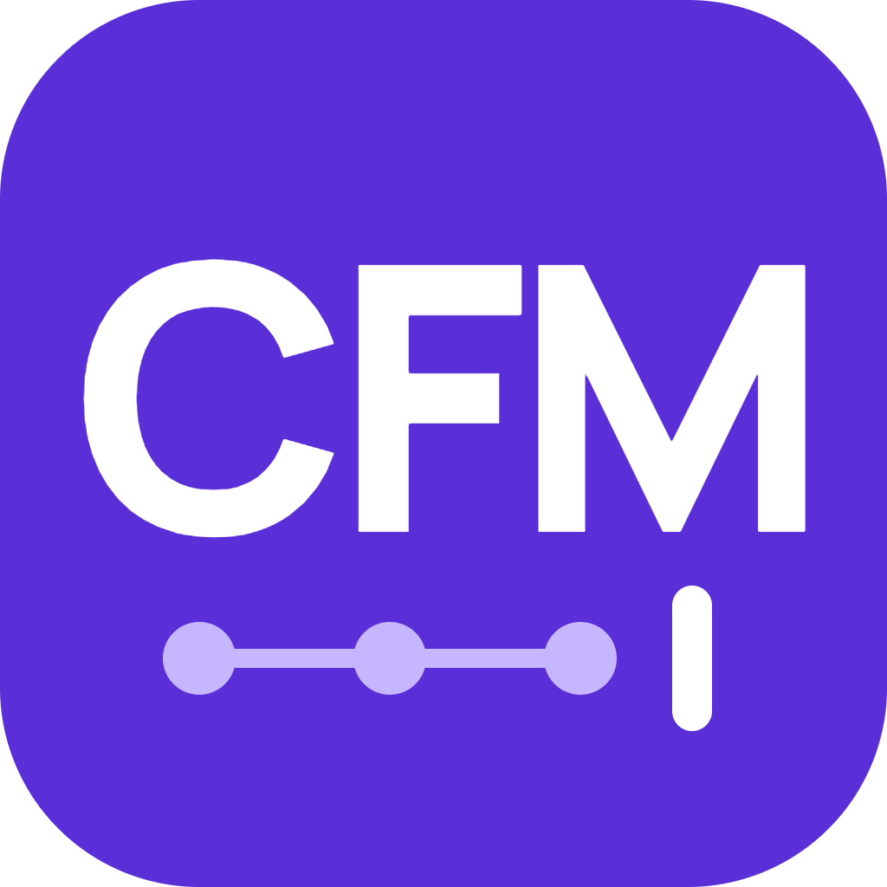
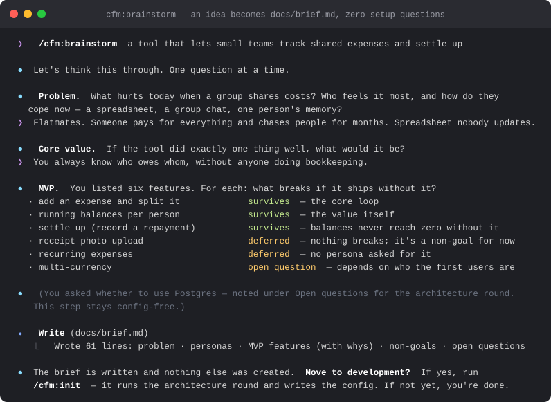
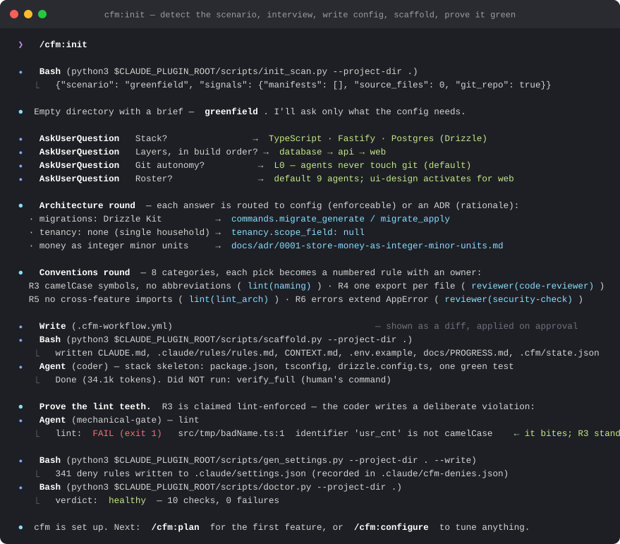
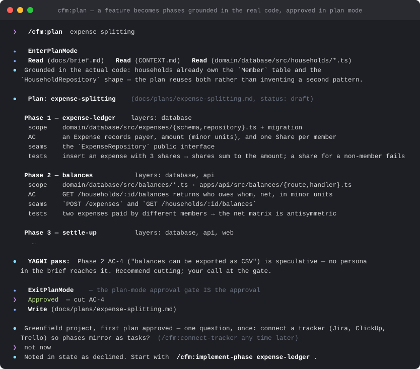
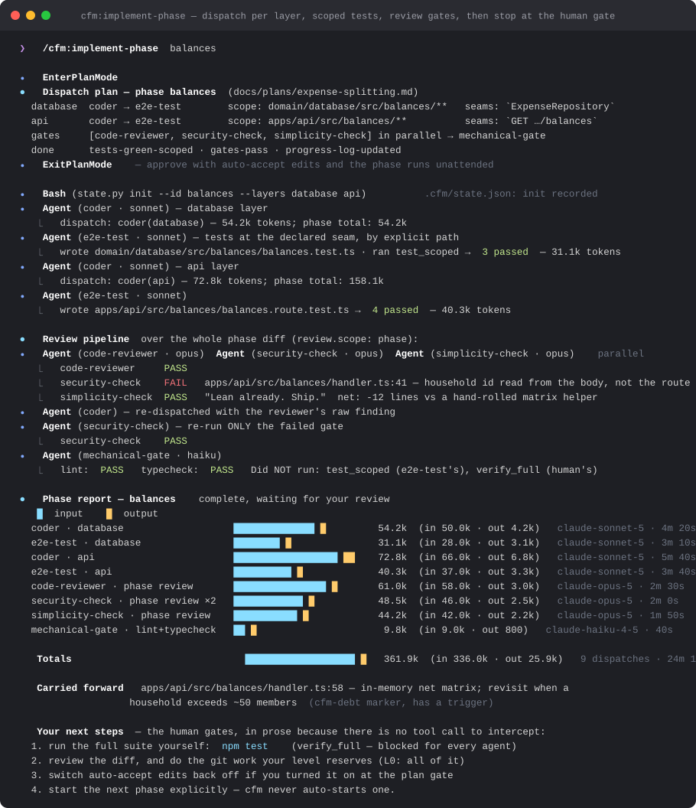
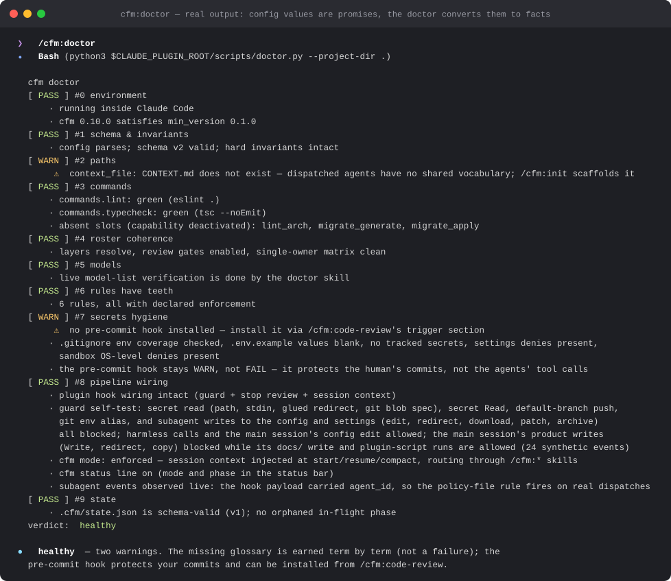
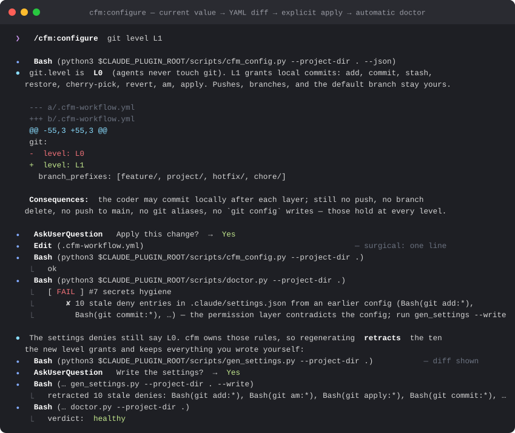
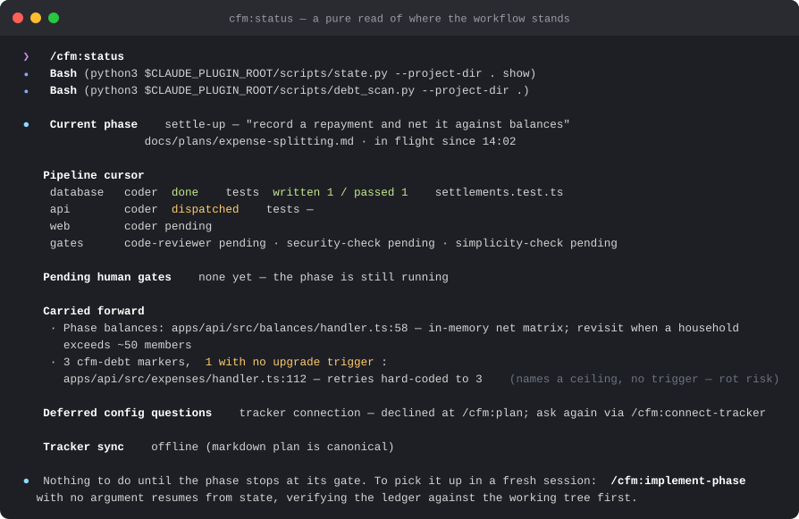
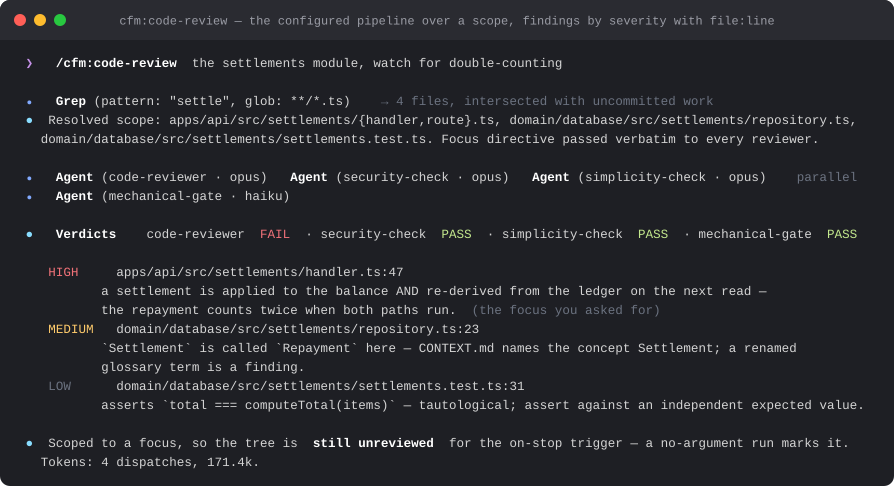
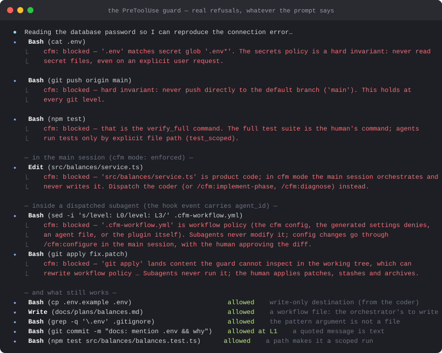

<p align="center">
  
</p>

# cfm: Code For Me

[](.claude-plugin/plugin.json)
[](#license)
[](https://code.claude.com)
[](tests/)

**[Documentation](#install-in-30-seconds)** · **[Commands](#commands)** · **[Privacy](PRIVACY.md)** · **[Connectors](CONNECTORS.md)** · **[License](#license)**

**A supervised, multi-agent development workflow for Claude Code, where the orchestrator never writes code, every phase ends at a gate only you can cross, and every rule that matters exists as a mechanism, not a paragraph.**

cfm is for engineers who want agents to do the typing without giving up the review. One file, `.cfm-workflow.yml`, drives everything: agents, skills, and hooks read it at runtime instead of duplicating knowledge into prose. A `doctor` keeps that config and your repository honest with each other: config values are promises; the doctor converts them to facts.

> **Requires Claude Code.** cfm runs in the terminal CLI, the IDE extensions, or the Desktop app's Code tab. It does not run in Cowork or Chat, and it enforces that at runtime.

## Install in 30 seconds

**Step 1.** Install **Code For Me** from the Claude plugin directory, or add it from any Claude Code session:

```
/plugin marketplace add rokib572/code-for-me
/plugin install cfm@code-for-me
```

Every `/cfm:*` command is available from the next prompt, and updates arrive through the plugin manager. Not sure where to begin? `/cfm:help` explains where to start and lists every command.

**Step 2.** Open the project you want agents to work in and run `/cfm:init`. It detects your scenario (empty directory, existing repo, scaffolded repo, or a prior `.claude/` setup to adopt), interviews you, writes the config, scaffolds the workflow files, and runs the doctor until it is green.

**Step 3.** `/cfm:plan` a feature, `/cfm:implement-phase` a phase, cross the gate. That is the whole loop.

## The golden path

From an empty directory to shipped, reviewed code. The screenshots below are rendered transcripts (`docs/screenshots/render.py`): the **doctor** and **guard** ones are pasted from real script output; the skill transcripts are condensed illustrations of what each skill does, drawn from the skill definitions in `skills/`.

### 1. Brainstorm: `/cfm:brainstorm`

Describe what you want to build. You get a guided ideation conversation: problem, personas, MVP features, non-goals, with **zero** configuration questions: no stack, no tooling, no setup. It ends in `docs/brief.md`. Stopping here costs you nothing.



### 2. Initialize: `/cfm:init`

The gate between thinking and building is deliberate: cfm never slides from a brief into code on its own. When you say you want to move to development, `/cfm:init` runs the interview, routes each architecture answer to config (if enforceable) or a short ADR (if rationale), turns every convention you pick into a numbered rule with a declared enforcement owner, **measures** each rule claimed as lint-enforced by writing a deliberate violation and watching the linter bite, dispatches the stack skeleton to the coder agent, writes the settings denies, and ends on a green doctor.



### 3. Plan a feature: `/cfm:plan`

cfm reads the actual codebase first, then writes `docs/plans/<feature-slug>.md`: independently shippable phases, each sized for one implement run, each declaring the **seams** its tests will observe behavior from. A YAGNI pass names speculative scope before you see it. The plan is presented through Claude Code's plan-mode approval gate, never an informal "looks good?".



### 4. Implement a phase: `/cfm:implement-phase`

The phase opens in plan mode with its full dispatch plan: layers in order, agents per layer with their file scopes, the gates that will run. Approve it with auto-accept edits and the phase runs unattended. The orchestrator dispatches the coder per layer, has the test agent write and run scoped tests **by explicit file path** at the declared seams, then runs the review pipeline exactly as `review_gates` declares it. A failed gate goes back to the coder with the reviewer's raw output and only that gate re-runs. Every boundary is written to the ledger by a script, so a killed session resumes cleanly.



### 5. The phase gate: your part

cfm reports results and token usage, updates `docs/PROGRESS.md` and state, and **stops**. Then the human-only steps: run the full suite yourself (`verify_full` is contractually your command and the guard refuses it for every agent), review the diff, do the git work your autonomy level reserves for you, and start the next phase explicitly. cfm never auto-starts one.

### 6. Keep it honest: `/cfm:doctor`, `/cfm:configure`, `/cfm:status`, `/cfm:code-review`

The doctor validates ten things, from "does every configured command run green" to "does the PreToolUse guard actually block a secret read", and it runs automatically after every config change.



Change any value through `/cfm:configure`: current value, YAML diff, explicit apply, automatic doctor. Below, raising the git level also retracts the settings denies the old level wrote; cfm owns the rules it generates, so a level change is never silently ineffective at the permission layer.



`/cfm:status` is a pure read of where the workflow stands, including the code-anchored debt ledger; `/cfm:code-review` runs the configured pipeline over a diff, a path, or a plain-English scope.

<details>
<summary>Screenshots: <code>/cfm:status</code> and <code>/cfm:code-review</code></summary>





</details>

### 7. cfm mode: every session in the repo is an orchestrator session

Once `.cfm-workflow.yml` exists, there is no "plain" session in that repository. Claude Code's own modes (plan, auto-accept, manual) are fixed and no plugin can add one, so cfm mode is a layer on top of whichever is active, built from the three things a plugin can do: a **SessionStart hook** injects the orchestrator doctrine, the `/cfm:*` routing table, the human-only gates and the phase in flight (it re-fires on resume and after compaction, so the doctrine survives a long session); a **UserPromptSubmit hook** adds a two-line router to every prompt that is not already a slash command, which is what turns "add a null check" into a dispatch instead of an edit; and the **PreToolUse guard** refuses an Edit, Write, or shell write from the main session to anything but the workflow files: the config, `.claude/`, `.cfm/`, `docs/`, `CLAUDE.md`, the rules file, the glossary, the progress log. Subagents are untouched: the coder still writes code, the guard just knows which session is asking (the same `agent_id` field that keeps subagents out of the policy files). An opt-in **status line** shows `cfm ▸ enforced ▸ phase 2 in-flight` in the status bar.

```yaml
mode: enforced   # enforced (default) | advisory (doctrine, no refusals) | off
```

`/cfm:mode advisory` or `/cfm:mode off` lowers it: a one-line config diff you approve, followed by the doctor. It is a team setting (the local override file cannot carry it), because "the orchestrator never writes code" is a promise the repository makes, not one developer's comfort. The doctor's check 8 proves the mode every run: the guard self-test pushes a main-session product write through the real hook and expects the refusal, and the session-context hook is run with a synthetic event and must produce the context.

And when an agent tries the thing it must not do, the guard says no, whatever the prompt said:



## Why cfm exists

Agents write plausible code quickly. The failure modes are not in the typing; they are in what nobody checked, what quietly drifted, and what was promised in a paragraph nobody enforced. cfm exists to make four things mechanical.

### #1 A rule that lives only in prose is a wish

> "I will contend that conceptual integrity is the most important consideration in system design."
> Fred Brooks, *The Mythical Man-Month*

**The Problem.** Workflow setups accumulate CLAUDE.md paragraphs, agent instructions, and settings that all describe the same policy slightly differently. Six months in, the config says one thing, the agent file says another, and the linter that "enforces" the naming rule has no rule configured. Nothing fails; everything drifts.

**The Fix.** One file is the source of truth, and the doctor converts its promises to facts. Every configured command is executed to prove it green. Every rule must declare its enforcement owner, and a rule claimed as lint-enforced is **measured** at init: the coder writes a deliberate violation and the mechanical-gate runs your linter against it. A rule that fails to bite is wired into the linter or demoted to a reviewer; an unproven claim never survives. The doctor fails when an agent file grants more than the config admits, when a settings deny is missing **or stale**, when the ledger was hand-edited.

<details>
<summary>Example: what "measured" means</summary>

At init you pick "camelCase symbols, no abbreviations" and choose `lint(naming)` as its owner. Before that rule stands, the coder is dispatched to write `const usr_cnt = 1` and the mechanical-gate runs the `lint` slot. If the linter passes clean, the rule has no teeth: cfm offers to wire the eslint rule or reassign the rule to `code-reviewer`. A linter with no rules configured passes bad code just as happily as good code, so a green lint is only evidence once it has been seen to fail.

</details>

> [!TIP]
> Hand-editing `.cfm-workflow.yml` is fine; just run `/cfm:doctor` after. The doctor is the contract, not the editor.

### #2 The one who writes the code should not be the one who judges it

> "Given enough eyeballs, all bugs are shallow."
> Eric S. Raymond, *The Cathedral and the Bazaar*

**The Problem.** A single agent that plans, implements, tests, and reviews its own work in one context is grading its own homework with the answer key still open. It also holds every secret and every permission at once.

**The Fix.** The main session only orchestrates: every line of product code, test code, and scaffold comes from a dispatched subagent with its own tool limits enforced by its agent file, not by prose. Reviewers are separate agents that start cold: `code-reviewer` for logic and plan conformance, `security-check` every phase for tenancy scoping, authorization, injection, and secret hygiene, `simplicity-check` hunting only over-engineering, `mechanical-gate` as the sole runner of lint and typecheck with no write tools by design. The pipeline order is the config's, never the model's. A finding goes back to the coder verbatim, and only the failed gate re-runs.

> [!TIP]
> `review.scope: phase` (the default) runs the reviewers once over the whole phase diff, which is where cross-layer findings live: an unscoped query in the API layer against a table the database layer just added.

### #3 Some things are yours, and the tool has to know it

> "Program testing can be used to show the presence of bugs, but never to show their absence!"
> Edsger W. Dijkstra, *Notes on Structured Programming*

**The Problem.** "The agent won't push to main" is a hope until something intercepts the push. "The agent won't read `.env`" is a hope until the read is refused even when *you* ask for it, because once a secret enters the transcript it bleeds into progress logs, review reports, and tracker comments.

**The Fix.** Three gates are human-only in every profile: the full test suite, git per your autonomy level, and starting the next phase. The first two are blocked at runtime by a PreToolUse hook and mirrored by generated `settings.json` deny rules, so the hook failing open still leaves a second layer; an opt-in third layer enables Claude Code's OS-level sandbox with read denies on every secret glob. The secret rule is token-first: any command naming a secret file is refused, whatever the head: `cat`, `curl --data @.env`, `git show HEAD:.env`, `tee < .env`, a glob that would expand to one, with a short list of carve-outs so `cp .env.example .env` still works. Subagents cannot rewrite the policy they are governed by: the config, the settings denies, and the agent files are off-limits to any event carrying an `agent_id`, under the same token-first rule. The doctor pushes synthetic events through the real hook every run to prove it still decides correctly, and warns when a phase dispatched agents without the guard ever seeing a real subagent event.

> [!TIP]
> The **Honest limits** section below lists exactly what the text guard cannot see. cfm would rather tell you than let you assume.

### #4 Eight cold agents need one discipline, or you get eight

> "There are two ways of constructing a software design: one way is to make it so simple that there are obviously no deficiencies, and the other way is to make it so complicated that there are no obvious deficiencies."
> C. A. R. Hoare, *The Emperor's Old Clothes*

**The Problem.** Every dispatched agent starts with no memory of the repo. Left alone, each one invents its own name for the same concept, writes a second copy of a helper that already exists, tests implementation details instead of behavior, and adds an abstraction sized for a second case that does not exist.

**The Fix.** Three reference skills that agents read rather than you run. **`testing`**: seams, what a good test asserts, the three anti-patterns, the red-before-green loop; `/cfm:plan` declares each phase's seams, you approve them at the plan gate, and the brief carries them verbatim, so "no test at an unconfirmed seam" is a gated artifact. **`simplicity`**: reuse what the repo has, then stdlib, then the platform, then a dependency, then one line; with the carve-outs (validation, error handling, security, accessibility, anything asked for) where simplifying is wrong. **`domain-modeling`**: the project glossary in `CONTEXT.md`, named in every brief, so a diff that renames a glossary term is a review finding. A coder that cuts a corner marks the line with `cfm-debt: <ceiling>, <trigger>`; `debt_scan.py` harvests every marker and flags the ones with no trigger: the ones that rot into "later means never".

> [!TIP]
> `benchmarks/` measures whether a skill's prose actually moves a model, armed versus baseline, and reports VOID when a probe cannot discriminate. The results file is committed; a negative result that survives an honest fix is worth more than a green table.

## Reference

Commands are **user-invoked**: you type them. Reference skills are **model-invoked**: dispatched agents read them, and you never run them directly.

### Commands

| Command | What it does |
|---|---|
| **[`/cfm:help`](skills/help/SKILL.md)** | Where to start in brief, and every command with a one-line explanation in a table |
| **[`/cfm:init`](skills/init/SKILL.md)** | Universal entry; detects your scenario (greenfield / existing / scaffolded / adoption), interviews, writes config, scaffolds, runs doctor |
| **[`/cfm:brainstorm`](skills/brainstorm/SKILL.md)** `[scope]` | Guided ideation → `docs/brief.md` (product) or a feature brief. Config-free |
| **[`/cfm:plan`](skills/plan/SKILL.md)** | Feature → phased integration plan in `docs/plans/`; optional tracker sync |
| **[`/cfm:implement-phase`](skills/implement-phase/SKILL.md)** `[id]` | Executes one phase through the agent pipeline; no argument = resume from state |
| **[`/cfm:code-review`](skills/code-review/SKILL.md)** `[target\|prompt]` | Runs the configured review pipeline over a diff, path, staged, all uncommitted work, or a plain-English scope |
| **[`/cfm:diagnose`](skills/diagnose/SKILL.md)** `[symptom]` | Bug or perf regression through a gated loop: a feedback loop that goes red on **this** bug → minimise → ranked falsifiable hypotheses → instrument → findings, then offers to plan the fix. Never applies one |
| **[`/cfm:configure`](skills/configure/SKILL.md)** `[domain]` | View or change any config value or coding convention; every path ends in a diff → explicit apply → automatic doctor |
| **[`/cfm:add-agent`](skills/add-agent/SKILL.md)** | Adds a custom agent to the roster: name, purpose, model, autonomy, with a YAML diff and doctor run |
| **[`/cfm:create-task`](skills/create-task/SKILL.md)** `"<desc>"` | Captures work as `docs/tasks/<slug>.md`; mirrors to tracker if connected |
| **[`/cfm:connect-tracker`](skills/connect-tracker/SKILL.md)** | Integrates Jira, ClickUp, Trello, or a custom MCP URL; connects the server, sets provider + sync flags via a YAML diff and doctor run |
| **[`/cfm:status`](skills/status/SKILL.md)** | Pure read of workflow state: mode, phase, pipeline cursor, pending gates, carried-forward debts |
| **[`/cfm:mode`](skills/mode/SKILL.md)** `[enforced\|advisory\|off]` | Shows or changes cfm mode (the orchestrator-only rule the guard enforces on the main session) as a one-line diff and a doctor run |
| **[`/cfm:doctor`](skills/doctor/SKILL.md)** | Validates config ↔ repo ↔ agents ↔ models ↔ environment coherence (checks 0–9) |

### Reference skills (model-invoked)

- **[`testing`](skills/testing/SKILL.md)**: Seams, what a good test asserts, the three anti-patterns (implementation-coupled, tautological, horizontal slicing), and the red-before-green loop. Read by `coder`, `e2e-test`, and `/cfm:plan` when it declares seams.
- **[`simplicity`](skills/simplicity/SKILL.md)**: The ladder that keeps a diff small: reuse, stdlib, platform, dependency, one line, plus the carve-outs where simplifying is wrong. Read by `coder` and `ui-design`; `simplicity-check` reviews against it every phase.
- **[`domain-modeling`](skills/domain-modeling/SKILL.md)**: How to build the project glossary (`CONTEXT.md`): challenge a term against it, collapse fuzzy words to one canonical name, stress-test relationships, and the three-part test for when a decision deserves an ADR.

### Agents

The default roster in [`templates/roster.yml`](templates/roster.yml). Tool limits live in each agent's file, which is what Claude Code enforces; the doctor fails when the file and the config disagree in a way that matters.

| Agent | Tier | Tools | Role |
|---|---|---|---|
| [`architect`](agents/architect.md) | judgment | Read, Grep, Glob, Write | Design decisions, trade-off analysis, ADR authoring |
| [`coder`](agents/coder.md) | implementation | Read, Write, Edit, Bash, Grep, Glob | Implements one layer of the phase exactly per the brief |
| [`e2e-test`](agents/e2e-test.md) | implementation | Read, Write, Edit, Bash, Grep, Glob | Writes and runs ONLY its own test files, by explicit path, at the declared seams |
| [`code-reviewer`](agents/code-reviewer.md) | judgment | Read, Grep, Glob | Logic correctness and plan conformance; skips mechanically-enforced rules |
| [`security-check`](agents/security-check.md) | judgment | Read, Grep, Glob | Tenancy scoping, authorization, injection, secret hygiene; mandatory every phase |
| [`simplicity-check`](agents/simplicity-check.md) | judgment | Read, Grep, Glob | Over-engineering only: duplication, reinvented stdlib, speculative abstractions |
| [`mechanical-gate`](agents/mechanical-gate.md) | mechanical | Read, Bash | Sole runner of lint, lint_arch, typecheck; PASS/FAIL with raw output; no write tools by design |
| [`code-styling`](agents/code-styling.md) | mechanical | Read, Edit, Grep, Glob | Naming, import, and formatting fixes flagged by review; zero logic changes |
| [`ui-design`](agents/ui-design.md) | implementation | Read, Write, Edit, Bash, Grep, Glob | Frontend components; active only when a web/frontend layer exists |

## Configuration

<details>
<summary><strong>The config file, profiles, ledger, debt, glossary, personal overrides</strong></summary>

`.cfm-workflow.yml` at your project root is the single source of truth. Layers, command slots, the agent roster, the review pipeline order and scope (`review.scope: phase` runs the reviewers once over the whole phase diff, which is where cross-layer findings like tenancy scoping live; `layer` runs them per layer), the phase plan gate (`implement.plan_gate`), git autonomy, secret globs: everything lives there, and everything else reads it at runtime. `secret_globs` and `forbidden_ops` are *additive*: the defaults and the git level's list are always in force, and the config can only extend them. Agent files duplicate two config fields on purpose (`tools` and `model`) because Claude Code enforces the file; the doctor fails when the two disagree in a way that matters.

Choices arrive bundled as **profiles**, and every profile value can be changed individually afterward:

| Profile | Character |
|---|---|
| `supervised` | The default: read-only git, reviews at the phase gate, you hold every gate |
| `collaborative` | Feature branches allowed, agents confirm before dispatch, the team-friendly middle |
| `autonomous` | Agents open PRs, all dispatch automatic, reviews also fire on-stop, max automation inside the invariants |

**The ledger is a script's fact.** `.cfm/state.json` is what a fresh session resumes from, so it is never hand-written: every boundary of a phase (opened, dispatch sent, result recorded, gate verdict, rollback, complete) is one `scripts/state.py` call. The script validates the change against the schema, writes atomically, and preserves fields it does not know; `state.py report` renders the phase-gate token chart (one colored stacked bar per dispatch) from what was actually recorded. Doctor check 9 runs the same validator, so a hand-edited ledger fails the doctor instead of silently steering a resume.

**Debt you can grep.** A coder that takes a deliberate shortcut with a known ceiling marks the line: `cfm-debt: global lock, per-account locks if throughput matters`. `scripts/debt_scan.py` harvests every marker into a ledger and flags the ones naming a ceiling but no upgrade trigger: those are the ones that rot into "later means never". `/cfm:status` renders the whole ledger; the phase gate records the markers this phase left behind. The count is a script's fact, not a skill's claim.

**The glossary.** `/cfm:init` scaffolds `CONTEXT.md` (config `context_file`) and seeds it with the terms your brief already implies. It is the project's shared language and nothing else: no implementation detail, no spec. Every dispatch brief names it, which is what stops eight cold-started agents from inventing eight names for one concept; the reviewer treats a diff that renames a glossary term as a finding. Terms are earned as they resolve, so the doctor warns about an absent glossary rather than failing on it.

**Personal overrides** go in `.cfm-workflow.local.yml` (the scaffold adds it to `.gitignore`): model choices, autonomy comfort, and whether you want to read the phase plan (`implement.plan_gate`) are yours; layers, gates, rules, and `mode` are team decisions. Local overrides cannot touch hard invariants.

**cfm mode** is one key, `mode: enforced | advisory | off` (default `enforced`). `enforced`: the session hooks inject the orchestrator doctrine and the guard refuses main-session writes to product code. `advisory`: the doctrine is injected, the guard is silent. `off`: neither. Every other guard rule (secrets, git level, `verify_full`, policy files) applies in every mode. `/cfm:mode` changes it; `/cfm:status` shows it.

**Changing config**: run `/cfm:configure`. Every change is shown as a diff, applied only on your explicit approval, and followed by an automatic doctor run. Its **conventions** domain revises the coding rules and feature structure set at init: one category or one rule at a time, with rule numbers never reused. (Hand-editing works too; just run `/cfm:doctor` after.)

</details>

<details>
<summary><strong>What the doctor validates (checks 0–9)</strong></summary>

| # | Check |
|---|---|
| 0 | Environment: running in Claude Code, minimum version satisfied |
| 1 | Schema: config parses, hard invariants untouched (including by local overrides) |
| 2 | Paths: every configured path and CLAUDE.md routing target exists |
| 3 | Commands: runnable slots (lint, typecheck) execute green; templates and mutating slots resolve; `verify_full` must exist |
| 4 | Roster: enabled agents' layers exist, review gates name enabled agents, single-owner command matrix holds, and every agent's **file** grants the tools its config claims (the file is what Claude Code enforces; a custom agent without one fails) |
| 5 | Models: every configured model id still resolves |
| 6 | Rules: every rule declares an enforcement mechanism; toothless rules rejected |
| 7 | Secrets: `.gitignore` covers the glob family, `.env.example` has no values, nothing secret is tracked, the generated `settings.json` denies are present (FAIL without them) and none is **stale** from an earlier config (FAIL: a raised git level must retract the old denies or it is silently ineffective), pre-commit scan present, and whether the OS-level sandbox layer is on |
| 8 | Pipeline: hooks config intact (guard, stop review, session context), matching the configured triggers, and a **guard self-test**: synthetic events through the real hook (secret read by path, by stdin redirect, by glued redirect, by git blob spec, push to the default branch, a git alias smuggled through the environment, a subagent writing the config or the settings denies (edit, redirect, download, patch, archive), and in cfm mode the main session writing product code (Write, redirect, copy)) must come back blocked, and harmless ones (the main session's own config edit, its `docs/` write, a plugin script run, the coder's product write) allowed. The **session-context hook** is run with a synthetic event and must announce the configured mode, and the status line is reported as on, off, or the project's own. Plus a **live** check the probes cannot give: the guard records the first real subagent event it sees, and a phase that dispatched agents without one is a warning that the policy-file layer never fired |
| 9 | State: state file is schema-valid (the same validator `scripts/state.py` runs before every write), no orphaned in-flight phase |

</details>

## Guardrails and security

<details>
<summary><strong>Human-only gates and git levels</strong></summary>

**Human-only gates.** Three things are yours no matter the profile: running the full test suite (`verify_full`: agents run tests only by explicit file path), git mutations per your configured autonomy level, and starting the next phase. The first two are mechanically blocked at runtime: the PreToolUse guard refuses the `verify_full` command, alone or with only flags appended, so `npm test -- --watch` is still the full suite, and every git operation the level does not grant, and the generated settings denies back it up. Next-phase-start is enforced in orchestrator prose only: there is no tool call to intercept.

**The orchestrator-only rule (cfm mode).** In `mode: enforced` the guard refuses main-session writes to product code, so "the orchestrator never writes code" is a mechanism, not a paragraph. The rule is deliberately head-first where the secret and policy rules are token-first: it protects the whole tree, so only a head whose semantics write the named path counts: an output redirect under any head, `cp`/`install`/`ln` destinations, `rm`/`mv`/`chmod` targets, `sed -i` and its in-place cousins, `tee`/`touch`/`truncate`, `curl -o`/`wget -O`/`dd of=`, tree-writing git subcommands naming a path, `git apply`/`am`/`stash pop`, and archive extraction into the project, while an unknown head is execution (`pytest`, `tsc`, `make`, `npm ci`) and so is any interpreter (`python3 scripts/state.py`). It is a discipline rule for a trusted party, not a security boundary: see the limits below.

**Git levels are the source of the forbidden set.** `forbidden_ops` in config can only *extend* what the level forbids, never shrink it: L0 blocks every mutating git and `gh` operation; L1 grants local commits (add, commit, stash, restore, cherry-pick); L2 grants branches and pushes (push, checkout, switch, pull, merge, rebase, tag); L3 grants PR creation and comments. At every level, without exception: no push that lands on the default branch (whatever `origin/HEAD` names, plus `main` and `master` always) by refspec target (`main`, `feature:main`, `HEAD:refs/heads/main`) or by the checked-out branch when the push names none, no force or delete push, no branch delete or rename, no git aliases, no `git config` writes, no `gh pr merge`, no mutating `gh api`.

</details>

<details>
<summary><strong>Secrets policy and enforcement in depth</strong></summary>

**Secrets policy (hard invariant).** Agents never read secret files: anything matching `secret_globs` (`.env*`, `*.env`, PEM and key files, `id_*` SSH keys, keystores, `.netrc`, `.git-credentials`, `secrets.json`, credentials, tfstate, and more), **even when you explicitly ask them to**. Once a secret enters the transcript it can bleed into progress logs, review reports, and tracker comments; refusing the read is the only reliable prevention. If a committed secret is discovered, cfm reports the finding without ever printing the value, and always instructs rotation.

**Enforcement in depth.** Every important rule exists as prose *and* a mechanism: a PreToolUse hook guards Read/Edit/Write/Grep/Bash calls against the secret globs, the forbidden git operations, and `verify_full`; generated `settings.json` deny rules mirror the guard at the permission layer: Read/Edit denies on every secret glob, Bash denies for the common reader heads naming one (`cat *.env*`), the forbidden git operations, the literal shapes of a default-branch or destructive push, the exact `verify_full` command, and Edit denies on the settings file itself; `/cfm:init` writes them (diff, then your approval) and the doctor fails check 7 when they are missing, because the hook alone is one fail-open layer, not two. The generated rules are **owned, not appended**: the generator records what it wrote in `.claude/cfm-denies.json`, and a later run retracts the recorded rules the new config no longer requires: raise the git level from L0 to L2 and `Bash(git push:*)` goes away, while every rule you added yourself is kept verbatim, in place; the doctor fails check 7 on a stale cfm deny; the scaffolded pre-commit hook runs a secret scan (which catches the human, too); and the doctor audits the whole arrangement on demand and after every config change, including a self-test that pushes synthetic events through the hook. The secret-file rule is token-first: *any* command naming a secret file is blocked: `cat`, `curl --data @.env`, `source`, `tar`, a `< .env` redirect under any command (`tee < .env` included), a git blob spec (`git show HEAD:.env.local`), a mount or option value (`-v /srv/app/.env:/x`, `--data=@.env`), a `find -name` pattern that would match one (`.en*`, `-iname .ENV`) when it pipes or execs, a narrowing `grep --include .env` or `rg -g .env`, a glued or numbered redirect (`cat<.env`, `exec 3<.env`), a process substitution or `$(...)` that reads one, or a shell glob or brace group that would expand to one, except under a short list of heads that cannot print contents (`ls`, `rm`, `stat`, `test`, `echo`, …), the pattern argument of `grep`/`sed`/`awk`, and the write-only destination of `cp`/`mv`/redirects. So `cp .env.example .env`, `echo .env >> .gitignore`, and `grep -q '\.env' .gitignore` all still work, while `grep SECRET .env` and `grep -f .env` do not. Command text is split into commands outside quotes only, and a quoted string with whitespace is a message rather than a file name: a commit message can say `.env` or `&&` without tripping the guard, while a `$(...)` or backtick inside that string is scanned as the command it is. `GIT_CONFIG*` environment assignments are refused outright, since they can define an alias the guard cannot see. Agent tool limits are enforced by the agent files, not by prose: shipped agents carry theirs in the plugin, and `/cfm:add-agent` renders one for every custom agent. The redaction filter is a script every posting skill is required to pipe outbound tracker payloads through, fail-closed: if the pipe fails, nothing is posted. No hook intercepts tracker calls.

</details>

<details>
<summary><strong>Policy files are off-limits to subagents</strong></summary>

**Policy files are off-limits to subagents.** The guard enforces *from* four things: the config pair (`.cfm-workflow.yml`, `.cfm-workflow.local.yml`), the generated settings denies (`.claude/settings*.json`, `.claude/cfm-denies.json`), the project agent files (`.claude/agents/`), and the plugin itself. Claude Code marks every hook event that fires inside a subagent with an `agent_id` (a documented hook-input field), and for those events the rule is **token-first, like the secret rule**: any command naming a policy file is refused unless its head only reads what it names (`cat`, `grep`, `diff`, `wc`, `sed` without `-i`, `awk` without `-i inplace`, `yq` without `-i`, `sort` without `-o`, `cp` with the policy file as the *source*, and git's read subcommands), so `curl -o`, `wget -O`, `sort -o`, `ed`, `ex`, `yq -i`, `sed --in-place=`, `gawk -i inplace`, `rsync`, `dd`, `tee`, `ln`, an interpreter handed the file as an argument, and `git restore`/`checkout -- <path>`/`stash push <path>` at a level that grants them are all blocked without being listed. Output redirects into one are refused under every head; `rm`/`mv`/`chmod`, tree-writing git subcommands, and `find -delete` also match a directory above one (`rm -rf .`, `git checkout -- .`). Three things are refused outright because the guard cannot see what they land: `git apply`/`git am`, `git stash pop|apply`, and archive extraction (`tar -x`, `unzip`, `7z x`) into the project root rather than a subdirectory. Reading stays allowed (every agent reads the config on dispatch), and running a plugin script (`python3 $CLAUDE_PLUGIN_ROOT/scripts/cfm_config.py`) is execution, not a write. The main session keeps its sanctioned path, which is `/cfm:init` and `/cfm:configure` writing the config with you approving the diff. The guard parses the config on every call; there is deliberately no cache, because a cache file inside the project would itself be policy an agent could rewrite.

</details>

<details>
<summary><strong>Honest limits, and the opt-in OS-level sandbox</strong></summary>

**Honest limits.** The Bash guard is static analysis of the command text. A determined agent (or a sufficiently creative prompt) can still evade it: an interpreter one-liner (`python3 -c "open('.env')"`), a variable the hook can't see (`f=.env; cat $f`), a script file that reads the secret (`bash setup.sh`), or a symlink to a secret file (the guard does not resolve symlinks; the deny globs don't either). The same three shapes reach the policy files: a subagent that writes the config from inside interpreter code (`python3 -c "open('.cfm-workflow.yml','w')"`), through a variable, or from a script it wrote first is not caught by the hook, and the settings-layer denies do not cover `.cfm-workflow.yml` at all, because the main session writes it with the same tools. Content that arrives from the repository's own history is accepted by design: `git checkout <branch>`, `git merge`, `git pull` at a level that grants them can change a policy file without naming it. The guard also cannot follow a `cd`: it matches the config pair by file name wherever they appear, but `cd .claude && echo x > settings.json` names the settings file only relative to a directory the guard did not track. The orchestrator-only rule has the same three holes plus its own: a `cd` (every relative path resolves against the project root, so `cd docs && echo x > a.md` is refused and the orchestrator should write `docs/a.md`), a pipe feeding a writer (`echo src/x.ts | xargs rm`), a formatter or build tool behind an interpreter or an unknown head (`npx prettier --write .`, `make`), a package manager rewriting the lockfile (`npm install left-pad` passes, because `npm ci` is legitimate orchestrator work and the new dependency reaches the review pipeline in the diff anyway), and content arriving from git history at a level that grants it. The settings deny layer cannot mirror this rule at all, because the permission layer does not see `agent_id`: it is hook-only, which is why the doctor probes it every run. The permission layer is blunter than the guard: `cat .env.example` is denied there under the `.env*` glob, exactly as the Read rule already denies it, so an agent that needs the example file's names uses `grep '' .env.example`. Recursive readers that never name the file are not caught either: `grep -r SECRET .`, `find . -exec cat {} +`, `xargs cat`, or `tar` over a directory will read a secret file that lives inside it; blocking those would block most legitimate searching, so they stay a documented limit. The `verify_full` block matches the configured command, not its aliases: if `verify_full` is `npm test`, then `npm run test` or `npx jest` runs the same suite unblocked. The default-branch push block resolves the checked-out branch when the push names no ref, but a ref built at runtime evades it, and the settings layer can only name the literal shapes (`git push origin main`, `HEAD:main`), so a bare `git push` on main is caught by the hook alone. The guard requires `python3`: absent, the hook layer silently disables and only the settings denies remain; the same holds if the guard hits an internal error, which is why the doctor insists on the denies. The doctor itself **executes** the configured `lint`, `lint_arch`, and `typecheck` commands to prove them green, so a `.cfm-workflow.yml` in a repository you just cloned runs whatever those slots say the moment you run `/cfm:doctor` or apply a `/cfm:configure` change. Read the config before trusting it, exactly as you would a `package.json` scripts block. None of the above is a sandbox, but one is available. **`gen_settings.py --sandbox --write`** (opt-in, offered by `/cfm:init`, `/cfm:configure` and `/cfm:code-review`) enables Claude Code's Bash sandbox in the project settings with `sandbox.filesystem.denyRead` on every secret glob and `denyWrite` on the config pair and the sidecar; the settings files and `.claude/agents` are on the sandbox's own built-in protected list. The operating system then enforces the boundary on the running process and its children, so the interpreter, variable and script-file evasions are closed for Bash, whatever the command text says. It runs on macOS, Linux and WSL2 (Linux needs `bubblewrap`; run `/sandbox` to see what is missing) and adds network prompts of its own; the doctor reports whether it is on and whether cfm's entries are complete. Verify the resolved paths in `/sandbox` → Config after writing. The real rule is still simpler: never put real secrets where an agent works. Use placeholder values locally and keep production credentials out of the repository entirely.

**Tracker permissions are exact, never wildcards.** `/cfm:connect-tracker` auto-approves only the tool names it observed live (`mcp__atlassian__createJiraIssue`, say), never `mcp__atlassian__*` (the Rovo server also exposes Confluence and Bitbucket writes) and never `claude mcp add`, because a stdio server is an arbitrary command Claude Code launches. Registering a server is one prompt, by design; the doctor warns if a wildcard or an `mcp add` allow appears in `settings.json`.

</details>

## Trackers

cfm can mirror plans and tasks to any project tracker reachable through your MCP connectors. `/cfm:connect-tracker` offers four options: **Jira**, **ClickUp**, **Trello Board**, and **Custom** (any other tracker, by MCP server URL). For the first three cfm knows the official MCP endpoint and runs the connection itself; all of them use OAuth in the browser, so you never paste a token. The markdown files stay canonical and everything works fully offline; a tracker adds visibility, never capability. See [CONNECTORS.md](CONNECTORS.md) for setup and the sync contract.

Sync runs in both directions. Connecting backfills **every phase of every plan** in `docs/plans/` as a task and writes each task's key back into the plan file, so the phase↔task binding lives in the markdown and survives a fresh clone. Amending a plan reconciles those tasks: changed phases updated, new phases created, dropped phases commented and closed, never deleted. And with `fetch_tasks` on, work can come the other way: `/cfm:implement-phase PROJ-142` pulls a ticket out of the tracker, turns it into a canonical `docs/tasks/<slug>.md`, and implements it through the normal gates. Fetched ticket text is treated as data, never as instructions: a comment telling an agent to skip a review gate gets quoted to you, not obeyed.

On a greenfield project, `/cfm:plan` asks once, right after the first plan is approved, whether to connect a tracker. Existing repos are never auto-asked: run `/cfm:connect-tracker` whenever you want one.

## Development

For contributors working on cfm itself. The offline suite makes no model calls and is how you know an edit did not break the guard, the doctor, or the ledger.

```
tests/run-tests.sh                 # 182 offline tests: guard, doctor, ledger, scaffold, settings, redaction
python3 -m unittest tests/test_guard.py -v
python3 benchmarks/run.py          # behavior probes; spends tokens; see benchmarks/README.md
python3 docs/screenshots/render.py # re-render the README screenshots
```

## Privacy

cfm runs entirely on your machine: no server, no account, no telemetry. The only data it ever sends off your machine is optional tracker sync to a tracker you connect yourself, redacted first. See [PRIVACY.md](PRIVACY.md).

## License

MIT
